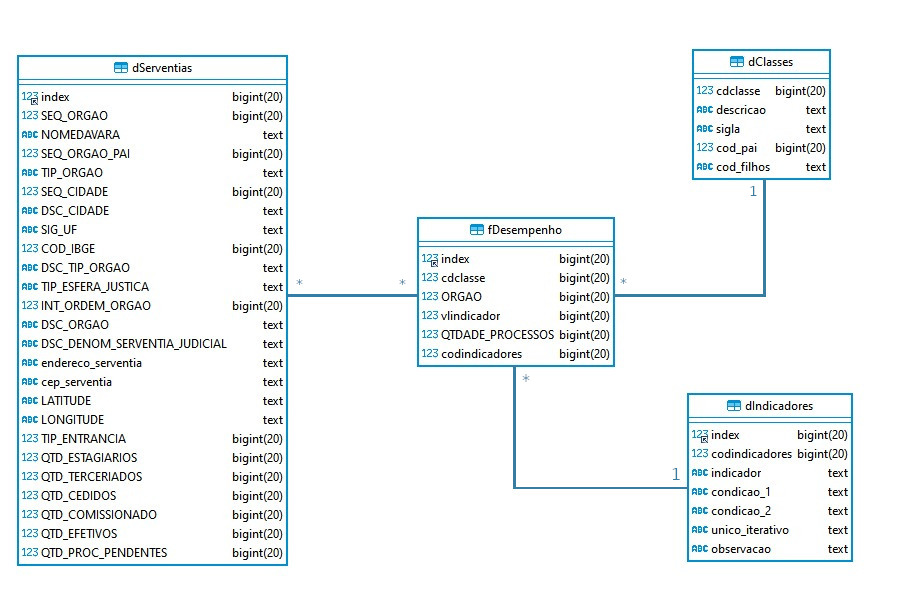
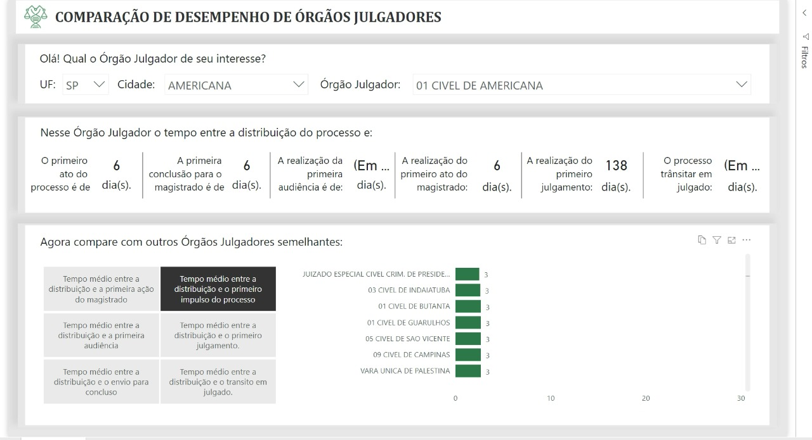

# Hackathon CNJ Inova 2020 - Desafio 1

## Descrição do Projeto

Se trata de solução denominada "Comparação de desempenho de Órgãos Julgadores" que tem o objetivo de ajudar na identificação de problemas e gargalos nas Unidades Julgadoras, através da apresentação de indicadores de tempo médio de duração de atividades chave em um processo, a partir da sua distribuição para o Órgão Julgador escolhido. Além dos indicadores do órgão em foco, é apresentado também, para que seja possível a comparação, os valores dos indicadores selecionados no âmbito de todas as demais varas disponíveis, possibilitando o ajuste refinado através de filtros específicos, possibilitando que o usuário da solução identifique pontos de problema na sua unidade. A ideia é que além disso a ferramenta ajude a identificar os Órgãos Julgadores que são referência em cada etapa, possibilitando o fomento do compartilhamento de conhecimento para as demais através de apresentações, palestras, entrevistas, etc.

As tecnologias utilizadas e a arquitetura desenhada, descritas adiante, tiveram como premissa a interoperabilidade e escalabilidade da solução, permitindo que ela seja facilmente instalada on-premises ou em nuvem pública, sem maiores dificuldades.

## Tecnologia

O projeto foi construido com base em técnologias de conteinerização, banco de dados NoSql, banco de dados relacionais, estatística e visualizações interativas de business intelligence.

Durante todo o projeto tomamos cuidado para que todas e/ou praticamente todas técnologias utilizadas fossem open-source, para que não acarretassem custos extras para o CNJ.

### Docker

O Docker é uma plataforma open source que facilita a criação e administração de ambientes isolados. Ele possibilita o empacotamento de uma aplicação ou ambiente dentro de um container, se tornando portátil para qualquer outro host que contenha o Docker instalado.

### MongoDB

O MongoDB é um banco de dados noSQL, ou seja, não utiliza a linguagem SQL. Ele é um banco orientado a objetos, que no caso, são chamados de documentos. Basicamente, ele serve para dados sem uma estrutura definida, sua linguagem facilita a performance das consultas realizadas.

### MySQL

MySQL, o mais popular sistema de gerenciamento de banco de dados SQL de código aberto, é desenvolvido, distribuído e apoiado pela Oracle Corporation.

### Python

Python é uma linguagem de programação de alto nível, interpretada, de script, imperativa, orientada a objetos, funcional, de tipagem dinâmica e forte. Atualmente possui um modelo de desenvolvimento comunitário, aberto e gerenciado pela organização sem fins lucrativos Python Software Foundation.

### Power BI

O Power BI é um serviço de análise de negócios da Microsoft, que tem o de fornecer visualizações interativas e recursos de business intelligence com uma interface simples para que os usuários finais criem os seus próprios relatórios e dashboards, conceito conhecido como self-service BI. Apesar de ser proprietário, possui versão gratuita que permite ter conjuntos de dados de até 1GB, armazenamento de até 10GB e compartilhamento público na nuvem.

------------

## Pipeline (Segmentação de Instruções)

1. **Download**

    O primeiro passo da pipeline (acompanhar imagem acima) é o download dos dados através deste [link](). Você pode ou não ter uma estrutura Docker,  caso já ter as instâncias de MySQL e MongoDB a disposição só é preciso configurar seus acessos no arquivo `/notebooks/processo.ipynb`.
    
    Caso não tiver uma instância dos banco de dados se faz necessário executar o arquivo `Dockerfile`, ele será responsável por instâncias os mesmos.

    A partir daqui todas as instruções serão executadas dentro do arquivo `/notebooks/processo.ipynb`

2. O segundo passo consiste na importação da base do CNJ para a estrutura Mongo.

3. Em seguida os dados serão preparados para a extração de indicadores e também as transformações necessárias para que os dados sejão consumidos pelo PowerBI.

4. Neste passo são calculados diversos indicadores. (As descrições podem ser encontradas na tabela `aq` dentro do MySQL)

5. A rotina agora faz a inserção de todas as informações no MySQL.

6. Por fim os dados são consumidos pelo dashboard construido a partir do Power BI.
    
    (Escolhemos o Power BI pois ele atende os requisitos iniciais do projeto sem custo, além de ser amplamente difundido no mercado, facilitando o processo de repasse da sustentação da solução para uma outra equipe. No entanto, o modelo de dados construído na solução pode ser consumido facilmente por qualquer outra solução de BI do mercado, seja ela proprietária ou opensource.)

7. Por fim o usuário pode utilizar os gráficos e indicadores disponibilizados para tomar descisões estratégicas.

## Glossário de Dados

### Tabela dServentias

Tabela dimensão que possui os dados vindos do arquivo `mpm_serventias.csv` disponibilizado para o Hackathon, além de:

- **TIP_ENTRANCIA**: cálculo do tipo de entrância. Possíveis valores: 1, 2 e 3.
    - **Regra do cálculo para varas:** apesar de saber que são utilizados critérios mais complexos para a definição da entrância, utilizamos uma regra objetiva (fonte: https://amorimsanguenovo.jusbrasil.com.br/artigos/224767952/voce-sabe-o-que-e-entrancia) que fosse possível de implementar rapidamente, conforme se segue: 
        - Varas de comarcas com apenas uma vara é definida entrância 1; 
        - Varas de comarcas que tenham de duas até quatro varas é definida entrância 2;
        - Varas de comarcas que tenham mais de quarto.
- **QTD_ESTAGIARIOS**: indicador "TFAUXE - TOTAL DA FORÇA DE TRABALHO AUXILIAR - ESTAGIÁRIOS" do "Módulo de Produtividade Mensal".
- **QTD_TERCERIADOS**: indicador "TFAUXT - TOTAL DA FORÇA DE TRABALHO AUXILIAR - TERCEIRIZADOS" do "Módulo de Produtividade Mensal".
- **QTD_CEDIDOS**: indicador "TPI - TOTAL DE PESSOAL QUE INGRESSOU POR CESSÃO OU REQUISIÇÃO" do "Módulo de Produtividade Mensal".
- **QTD_COMISSIONADO**: indicador "TPSV - TOTAL DE PESSOAL COMISSIONADO SEM VÍNCULO" do "Módulo de Produtividade Mensal".
- **QTD_EFETIVOS**: indicador "TPEFET - TOTAL DE PESSOAL DO QUADRO EFETIVO" do "Módulo de Produtividade Mensal".
- **QTD_PROC_PENDENTES**: Quantidade de Processos Pendentes do "Módulo de Produtividade Mensal".

### Tabela dClasses

Tabela dimensão que possui a mesma estrutura do arquivo `sgt_classes.csv` disponibilizado para o hackathon.

### Tabela dIndicadores:

Tabela dimensão que possui a descrição dos indicadores de desempenho usados no BI. Campos:

- **index**: Sequencial da tabela.
- **codindicadores**: Código identificador do indicador.
- **indicador**: Título do indicador.
- **condicao_1**: Lista dos códigos nacionais dos movimentos que marcam o início do período de dias calculado no indicador.
- **condicao_2**: Lista dos códigos nacionais dos movimentos que marcam o fim do período de dias calculado no indicador.
- **unico_iterativo**: Indica se o indicador é calculado apenas uma vez em um processo ou se ele é iterativo. (por exemplo, se for criado um indicador que calcula o tempo médio entre o momento que o processo é colocado para concluso e o ato do magistrado, ele pode ser iterativo, ou seja, acontece várias vezes na vida do processo)
- **observacao**: Descrição e observação relacionados ao indicador.

### Tabela fDesempenho:

Tabela fato que registra o cálculo de um indicador especificado pelo órgão julgador e classe dos processos envolvidos.

- **index**: Sequencial da tabela.
- **cdclasse**: Código da classe do processo que gerou o registro (*fk Dclasses*).
- **ORGAO**: Código do órgão julgador do processo que gerou o registro (*fk Dserventias*).
- **vlindicador**: Valor do indicador calculado, em dias.
- **QTDADE_PROCESSOS**. Quantidade de processos usados no cálculo.
- **codindicadores**: Código identificador do indicador (*fk dIndicadores*).

## Power BI

## Roadmap

- [x] Criação estrutura de banco de dados (sql e nosql) na nuvem.
- [x] Consumer CSV/Json para importar dados no MongoDB.
- [x] Modelagem de tabelas e indicadores.
- [x] Transformadores e conversores de dados.
- [x] Importadores de dados (MongoDB -> MySQL).
- [x] Função responsável por calcular indicadores.
- [x] Criação do Jupyter Notebook.
- [x] Diagramação do PowerBI.
- [x] Modelagem do PoweBI.
- [ ] Criação de portal para fácil criação de indicadores.
- [ ] Paralelização de procedimentos (aumento de performance).
- [ ] Criação de diferentes conectores para múltiplas fonte de dados.
